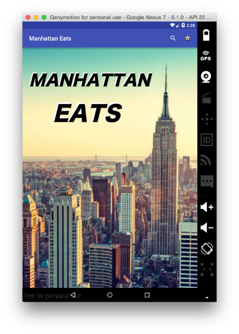
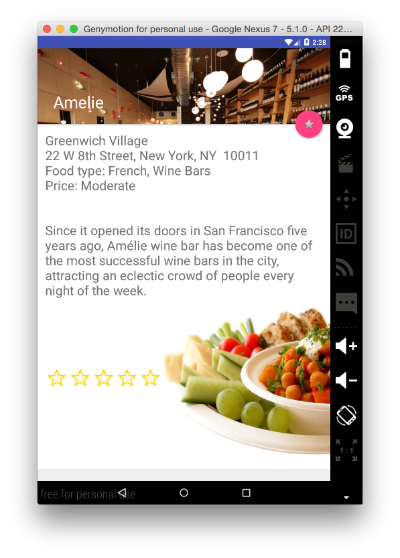
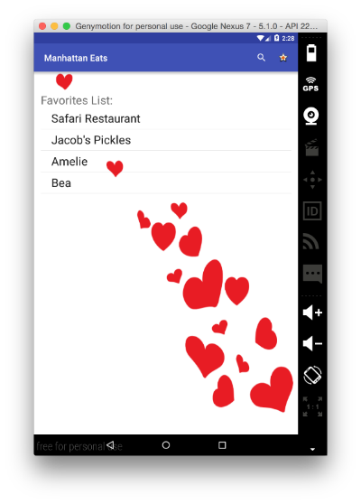

#2016-02-12
#Project 2
#Manhattan Eats by Chris Shum

My approach to this app was to attack all the functionality components first.  I kept it simple creating only one activity per major function, testing each one as I completed it.  Once finishing, I moved on to the material design.  Design is tough for me, and I became even more discouraged when I had been fully testing on my device only to find that the layout did not work as well for the emulator.  Fortunately I found documentation to support multiple screens.

All and all, I enjoyed the project.  I'm certain my code could be improved upon and would like to know how.  I also know I need much more work on material design.  Currently the app layout is optimized for the Genymotion AVDs Google Nexus 7 and 10.  Originally it worked on normal sized devices (my LG G4), however since I will be presenting, I figured it would be best to optimize for the emulator.  For some reason the Nexus 7 is categorized as a "normal", same as my device (which is 2 inches smaller diagonally).  Layout settings for device were saved however and can be easily switched.

Glitches:
Maps function does not work on Genymotion emulators.  I assume because it doesn't exist on the emulator?

Device crashes periodically, but could not recreate crashes.  Additionally, scroll on the details activity does not work on device for some reason.

Random button: Will only work as long as keyID#s in database are sequential and no numbers skipped.

##How to use:

###Main screen:
  The main page holds a general greetings, instructions on how to use the app, and a restaurant list.

  -To start:
  Clicking will lead you to the main page.

  -To select:
  Clicking on a restaurant in the restaurant list will open a details activity with the restaurant details.

  -To search:
  Clicking on the magnifying glass on the top right will allow you to search.
  My search function searches from 5 criteria, name, neighborhood, address, type of food, and price.
  My search function is also set to accept multiple words to narrow down the search, however because of the way it's set, you cannot search for two words in the same criteria (column.  ie. cannot search for cheap and expensive food at the same time.)

  -Favorites:
  Clicking on the start icon on the top right will open a favorites activity with the favorites list.

  -Surprise me:
  Clicking surprise me button will open details for a random restaurant.

###In details screen:
The details screen displays restaurant details and has a few features.

  -To favorite:
  Click on the floating star button to favorite/unfavorite

  -To rate:
  Click on the rating bar to rate.

###In favorites screen:
The favorites screen displays a list of your favorites.

  -To remove:
  You can long click to remove a favorite

##Screenshots:
 
  
   
